# Design competition - Mechatronic and robotic HHN WS18/19

This is my repository of the traditional design competition for new students, held at the University of Applied Science Heilbronn at the WS 18/19. It contains some background informations, code and the circuit diagram.

# Challange description

Construction of an autonomous vehicle, which is able to throw as many table tennis balls as possible from a 1.770x1.770 mm wide area. A total of 20 balls are randomly placed. A maximum of 4 AA batteries can be used. The robot must also fit into a shoe box when it is in a ready to drive mode. Furthermore, an Arduino board must be user for the control. Other controls are not permitted. It is also not allowed to intervene in the course of a running attempt.

# Design concept

In the planning phase we decided to pursure a concept in which the rable tennis balls should thrown out of the marked area with a wheel and a ramp. Ultrasonic sensors should be used to measure the distance on the bands. An absolute orientation of the robot is not provided. The robot should drive straight lines and rotate when reaching the end of the area. 
Some impressions of the robot called DaRRa (Das Runde Raus):

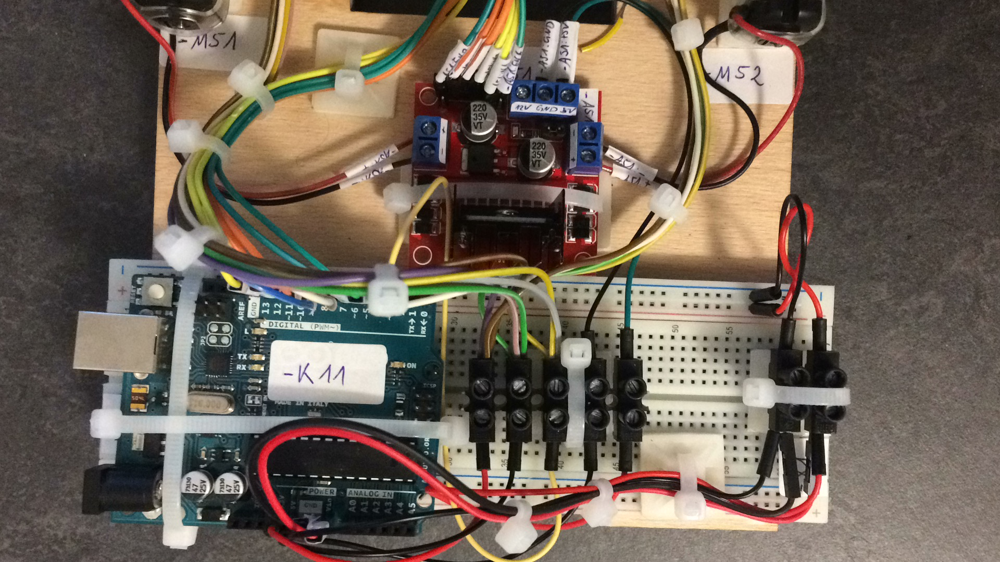
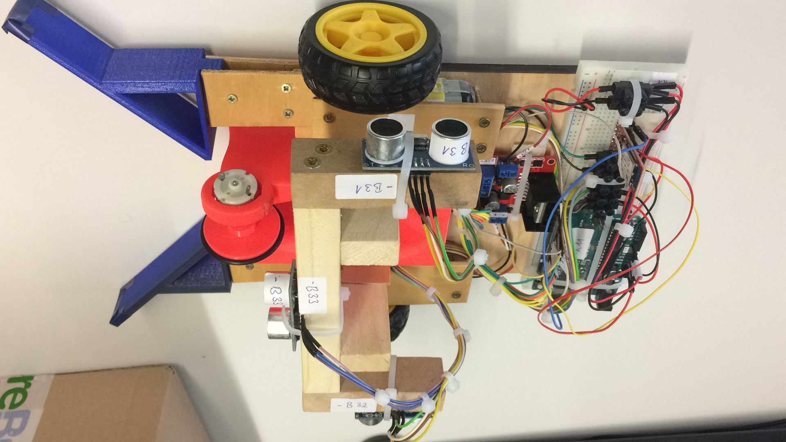
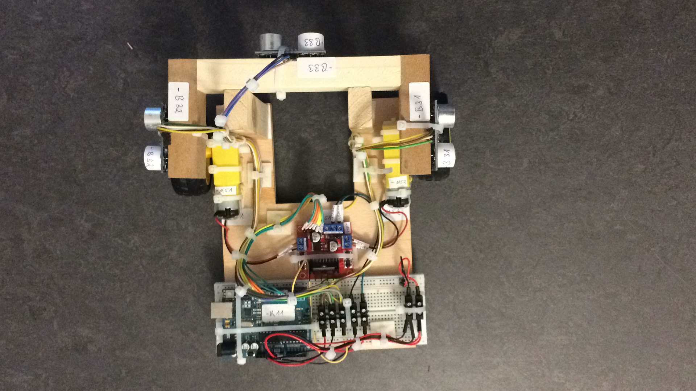

# Hardware

The hardware used by the DaRRa robot has been optimized for the lowes possible power consumption due to severely limited energy guidelines (only 4 AA batteries permitted). A graphical overview of the power supply can be found in the section Power Supply. 
During construction, the focus was on realizing the required functionalities with as gew operating resources as possible. At the same time, however, the maximum flexibility shoubld be made possible in order to solbe these complex task. 
The following table provides an inital overview of all electrical equipment used in the project. Stating their equipment identification, so that they are easier to identify in the circuit diagram. There are also a complete circuit diagram in this repository.

|                                                  |      BMK       | Description                                                                                                                                                                                                                                                                          |
| :----------------------------------------------: | :------------: | ------------------------------------------------------------------------------------------------------------------------------------------------------------------------------------------------------------------------------------------------------------------------------------ |
|          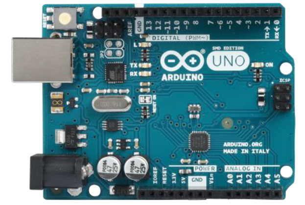          |      -F11      | The Arduino Uno is the heart of the DaRRa robot.  The Arduino provides flexible, simple and fast control of all actuators and sensors.                                                                                                                                            |
|          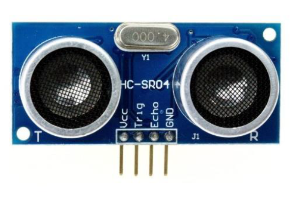           | -B31 -B32 -B33 | Distances at front and on the sides where measured by the ultrasonic sensors.                                                                                                                                                                                                        |
|           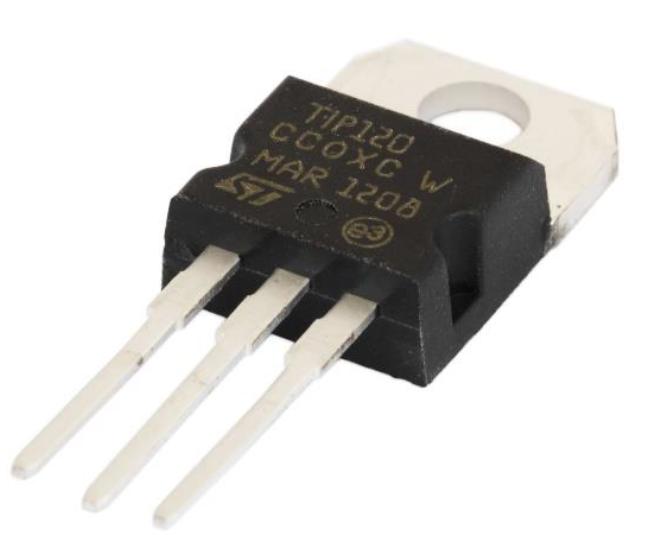           |      -Q41      | The Darlington transistor controls the DC motor for the Throwout-wheel.                                                                                                                                                                                                              |
|            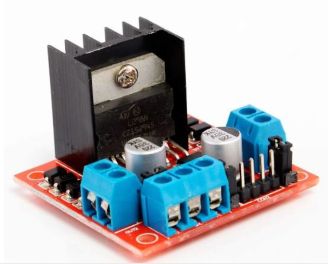             |      -A51      | This board was purchased as a ready to use component. The board has an L298-H-bridge with wich the motors of the main drive are controlled. This enables both a reversal of the direction and a speed adjustment.                                                                    |
|            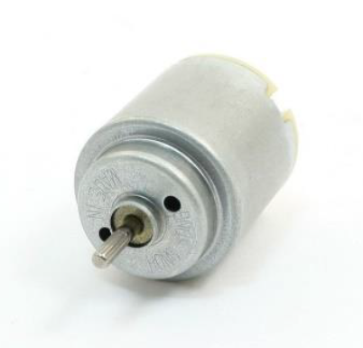            |      -M41      | The brushed DC motor where used to control the throwout wheel. A Darlington transistor (-Q41) starts or stops the motor.                                                                                                                                                             |
|       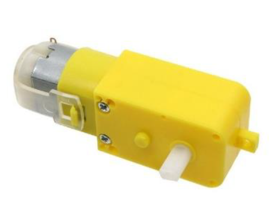       |   -M51 -M 52   | These are normal brushed DC motors, coupled with a reduction gear. This reduces the speed, but increases the torque.                                                                                                                                                                 |
|     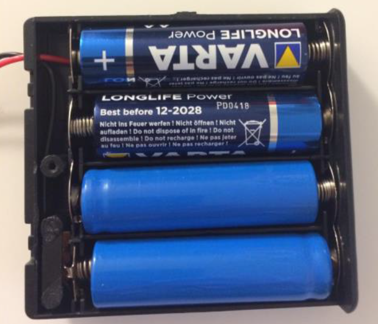     |     - U11      | As specified in the guidlines, 4 AA batteries were used for the energy supply. These batteries were placed in a housing with an on/off switch. In this way, the entire robot can easily be switched off. The batteries are connected in series, resulting in a total voltage of 6 V. |
| 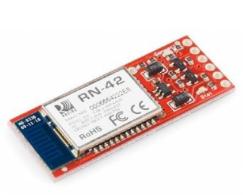 |      -A12      | The Bluetooth module is connected to the Arduino via the serial interface. The module is used to communicate with the DaRRa Interface. The module is powered with 3.3 V from the Arduino Pin.                                                                                        |

# Power supply

The entire energy supply is ensured by four AA batteries connected in series. The four 1.5 V AA batteries connected in series provides a total voltage of 6 V. However, this level drops significantly during operation. The battery voltage was connectoed to luster terminals and distributed to the individual electrical components.

  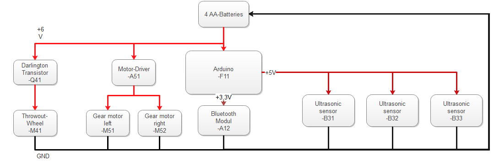

|                                    |                                                                                                                                                                                                                                                                                                                                                                                                                                                                                                                                                                                                                          |
| ---------------------------------- | ------------------------------------------------------------------------------------------------------------------------------------------------------------------------------------------------------------------------------------------------------------------------------------------------------------------------------------------------------------------------------------------------------------------------------------------------------------------------------------------------------------------------------------------------------------------------------------------------------------------------ |
| 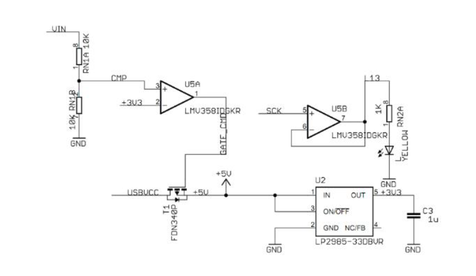 | The ultrasonic sensors and the bluetooth module are supplied by the Arduino's internal voltage converter. The internal power supply on the Arduino board can be seen in the following picture. With the amplifier U5A and the voltage divider in front of it, each with 10 kΩ resistors. They make it possible to connect higher voltage (see technical data sheet of the Arduino board) at the Arduino. For this reason the battery voltage is applied to the Vin pin. The voltage for the ultrasonic sensors is connected at the +5 V pin. The power supply for the bluetooth modul takes place at the +3.3 V pin.  |

# The Arduino Uno R3

The Arduino board is an open source developement board that is now available in serveral versions on the market. The third version of the Uno board was installed in the DaRRa robot. The Uno R3 is characterized by its smaller design compared to the competitor Mega 2560 provided by the university. In addition, the power consumption is low compared to other boards of the family. 
The following table shows the exact technical operating data of the board. As can be seen in the overview picture, the Arduino board can be connect to the PC and programmend via USB type B interface. A power supply is also guaranteed during the connection with the PC. The actuators and sensors are connecte to the digital I/O of the board.

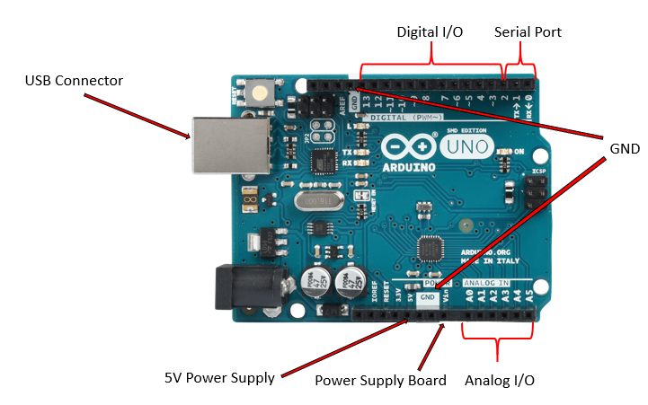

|                        |                 |
| ---------------------- | :-------------: |
| Operating voltage      |       5 V       |
| Input voltage          |     7-12 V      |
| Max. input voltage     |      20 V       |
| digital I/O pins       | 14 (6 with PWM) |
| analog pins            |        6        |
| DC current per I/O pin |      40 mA      |
| DC current for 3.3 V   |      50 mA      |
| Flash memory           |      32 kB      |
| SRAM                   |      2 kB       |
| EEPROM                 |      1 kB       |
| Mikcrocontroller       |   Atmega 328P   |

# LN298 Motor driver

The motor driver has an integrated double H-bridge to reverse the direction of rotation of the two motors and to vary speed via PWM. The following picture show how the motor driver module has to be connected. The input pins for forward and backward as well as the enabple pins for the PWM control must be connected to the Arduino according to the circuit diagram.

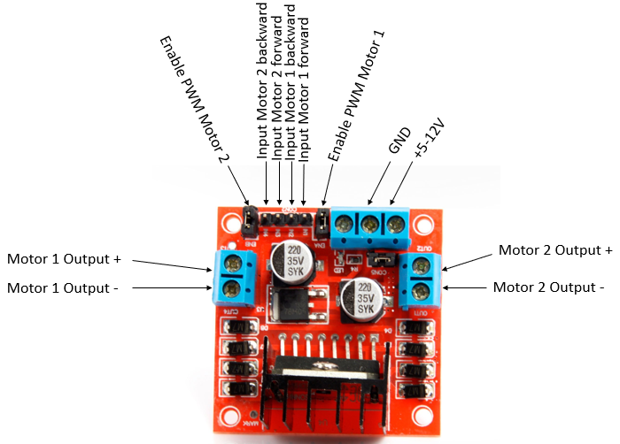

# Bluetooth module

The Bluetooth module comes from an electronics kit of the manufactor sparkfun. The sensor is supplied with a voltage of 3.3 V and can bea readn out via Rx/Tx interface. The Bluetooth module supports 2.4 GHz transmission rate.

# Software

The software of the DaRRa robot was implemented in the programming language C++. The Arduino libraries (Arduino.h) were used, but not programmed with the classic Arduino IDE. The Visual Studio Code program with PlatformIO extension was user for this purpose. Both are installed with little effort and make working with several \*.cpp files in a project much easier than the Arduino IDE. The structure and functionality of the software are documented in the following sections. The software can be grouped into thee main components:

<ol>
<li><b>Actuator/Sensor classes:</b> these classes encapsulate the control of all actuators and sensors as individual objects. These object are called up in the main program for each actuator/sensor.</li>
<li><b>Task functions:</b> these functions contain the control logic of the individual movements and processes such as cyclical distance measurement.</li>
<li><b>Main program:</b> the main program is running continously and a simple state-machine has been implemented here wich class the task functions under defined conditions.</li>
</ol>

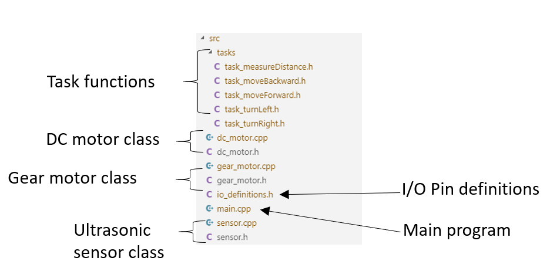

# State-Machine

The state-machine is the central logic controlling unit of the DaRRa robot. With the help of the state-machine implementation in the following picture, control over the correct sequence of movements is ensured. The state-machine is only activated as sonn as the operating mode has been set to **AUTOMATIC_MODE** by the software. The state-machine remains in **INIT_STATE** as long as the control command 'J' has been received via the serial interface. If this is the case, the state-machhine changes to **SETUP_STATE**. The throwout-wheel is started here. With a small time delay of two seconds, the state-machine automatically changes to **DRIVE_FORWARD_STATE**. This remains active until the sensor -B33 at the front reaches the minimum distance **MIN_DIST_FRONT**. This value is set to 200 mm by default. However, it can be changed as required via the DaRRa interface. If the distance is less than 150 mm, the sequencer chages to **DRIVE_BACKWARD_STATE** step so that the robot does not hit the wall when it turns. The sequence remains in this step until the sensor reports a distance of >= 150 mm again. If this is the case, a check is made to determine which side is suitable for rotation. This is done quering the distance between the sensor on the side (-B31 and -B32) in the switching conditions. If both sensors report a distance of more than the value specified in the MIN_DIST_SIDE parameter, the robot begins to turn to the right. If only one side delivers a larger value, it rotates in the corresponding direction. When TURN_RIGHT_STATE or TURN_LEFT_STATE has been executed, the state-machine automatically changes back to DRIVE_FORWARD_STATE.

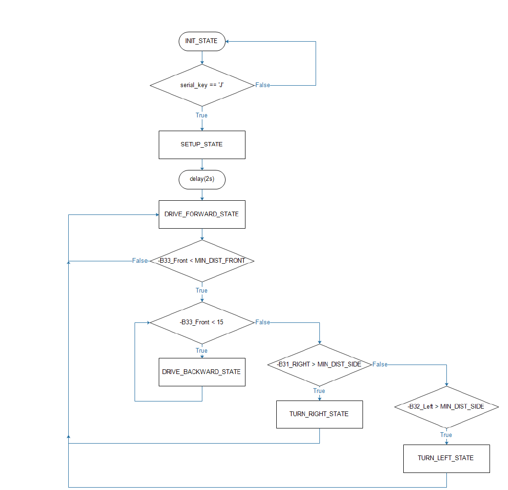

## Realtime control and monitoring

The DaRRa interface is a C# desktop application that was specially developed for convenient communication and monitoring. With the DaRRa interface, almost live measurements of the ultrasonic sensors can be observed and analyzed. It is also possible to siwtch between an automatic mode and a manual operating mode. Manual mode is highly recommended for commissioning the robot, as individual actuators can be controlled here. Furthermore, parameters such as turning time of the robot when cornering or the minimum distances between the sonsros until the robot executes a rotation can be conveniently set. In automatic mode, the DaRRa interface shows which step is currently being executed.

Screenshots:

  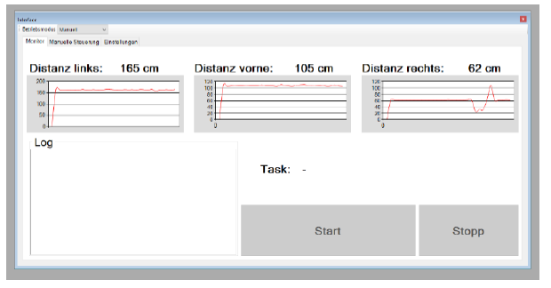
  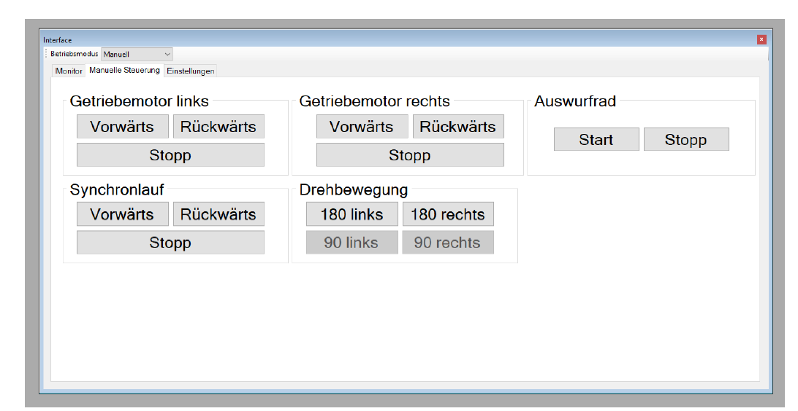
  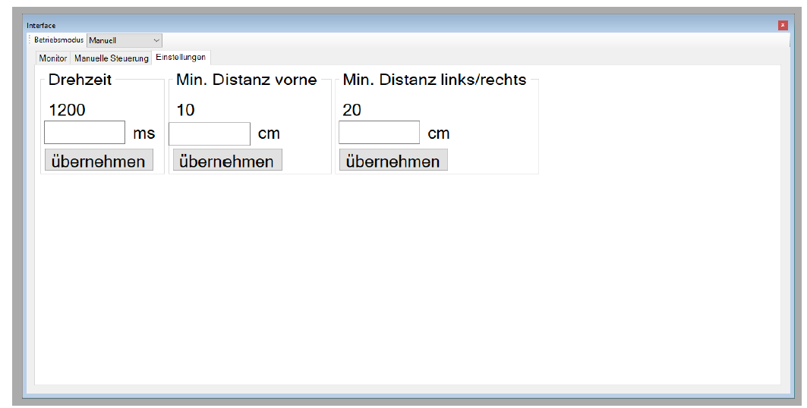

